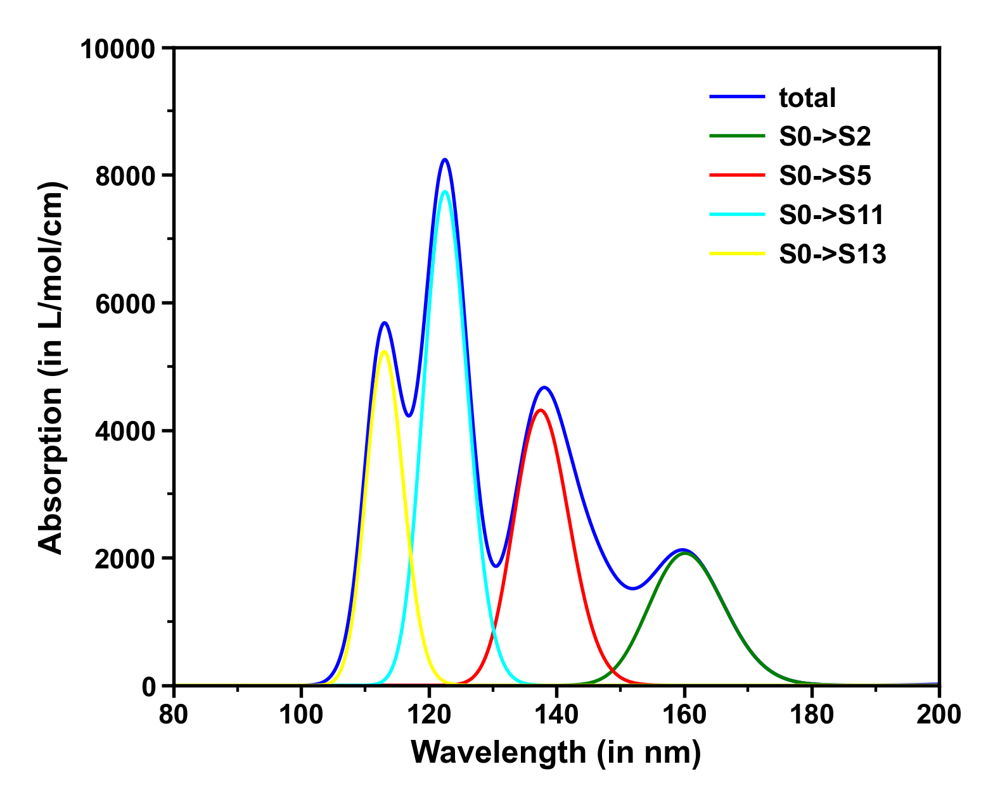
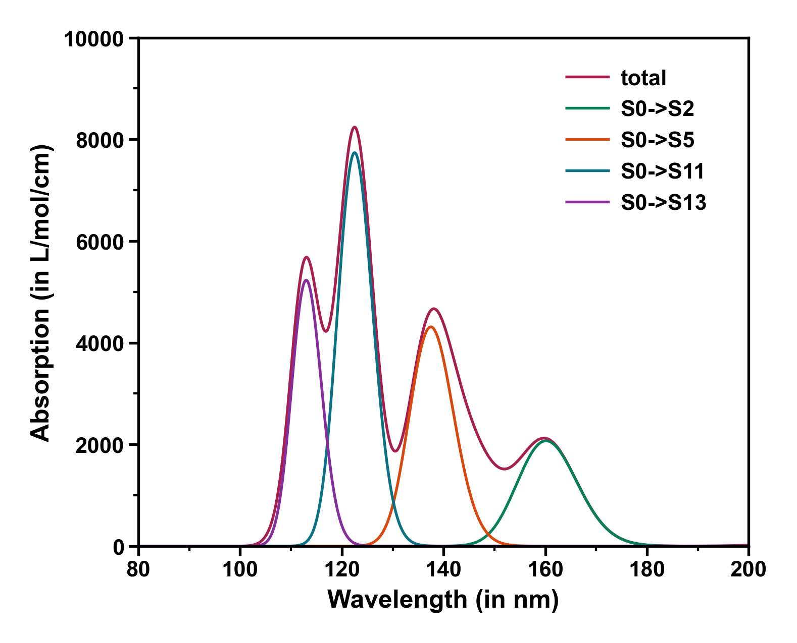
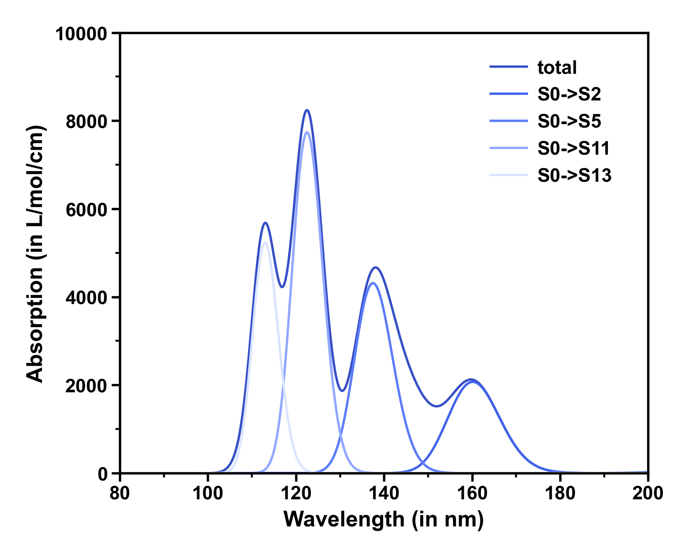

# SpecDraw

使用 Go 语言编写的可执行程序，用于批量执行 KimariDraw，同时生成合适的图像

## 有关 KimariDraw

KimariDraw 是 Kimariyb 用 Python 编写的绘图脚本，用于处理 Multiwfn 生成的光谱数据。详细信息请浏览 KimariDraw 的主页 https://github.com/kimariyb/kimariDraw

## 如何使用

1. 设置 Python 的环境变量，这里必须同时设置以下两个环境变量到 PATH 中。其中 `PYTHON_HOME` 是 Python 可执行文件所在的目录。

```shell
%PYTHON_HOME%/
%PYTHON_HOME%/Scripts/
```

2. 准备一个 `.txt` 文件，假设这个文件名为 `draw.txt`，该文件记录了 KimariDraw 程序中的命令。

```text
-6
5,4
-3
0
Wavelength (in nm)
-3
1
Absorption (in L/mol/cm)
2
80,200,20
3
0,10000,2000
1
```

3. 下载 `SpecDraw.exe`，将 `SpecDraw.exe` 和 KimariDraw 需要运行的 toml 文件和 txt 文件（这里的 txt 文件是 KimariDraw 需要的、由 Multiwfn 生成的 txt 文件）放置在同一个文件夹。运行 `SpecDraw.exe` 会在命令行中显示以下内容。程序会提示你输入一个 txt 文件，也可以输入 ENTER 键从 GUI 窗口中选择 txt 文件。

```shell
====================================================================
==      ========================       =============================
=  ====  =======================  ====  ============================
=  ====  =======================  ====  ============================
==  =======    ====   ====   ===  ====  ==  =   ====   ===  =   =  =
====  =====  =  ==  =  ==  =  ==  ====  ==    =  ==  =  ==  =   =  =
======  ===  =  ==     ==  =====  ====  ==  ==========  ===   =   ==
=  ====  ==    ===  =====  =====  ====  ==  ========    ===   =   ==
=  ====  ==  =====  =  ==  =  ==  ====  ==  =======  =  ==== === ===
==      ===  ======   ====   ===       ===  ========    ==== === ===
====================================================================

Input txt file path, for example E:\\Hello\\draw.txt
Hint: Press ENTER button directly can select file in a GUI window.
If you want to exit the program, simply type the letter "q" and press Enter.
```

4. 选择后文件后，等待程序运行即可。中途可能会提示 Error 等报错提示，可以不用理睬，一切以得到的结果为准。





## 支持的版本

SpecDraw 目前仅支持 KimariDraw 2.5.1.3 版本。