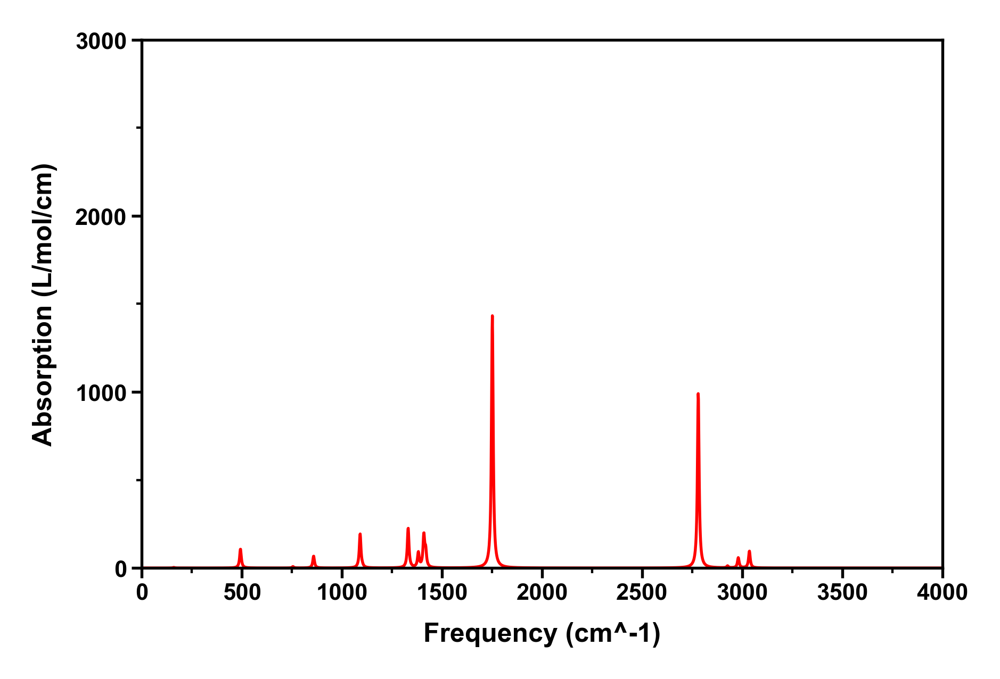
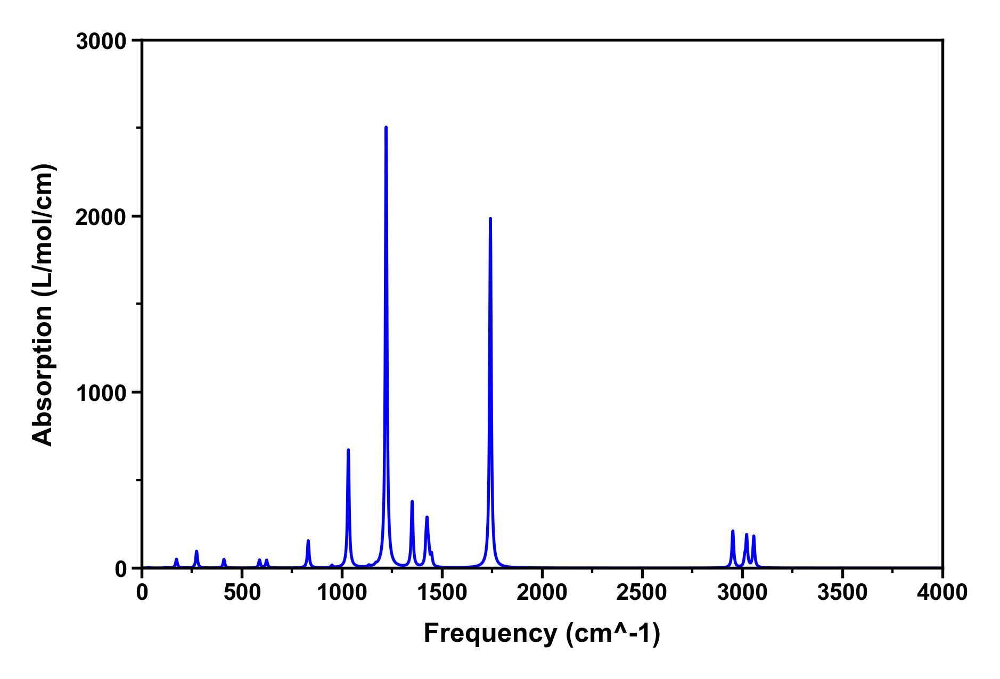
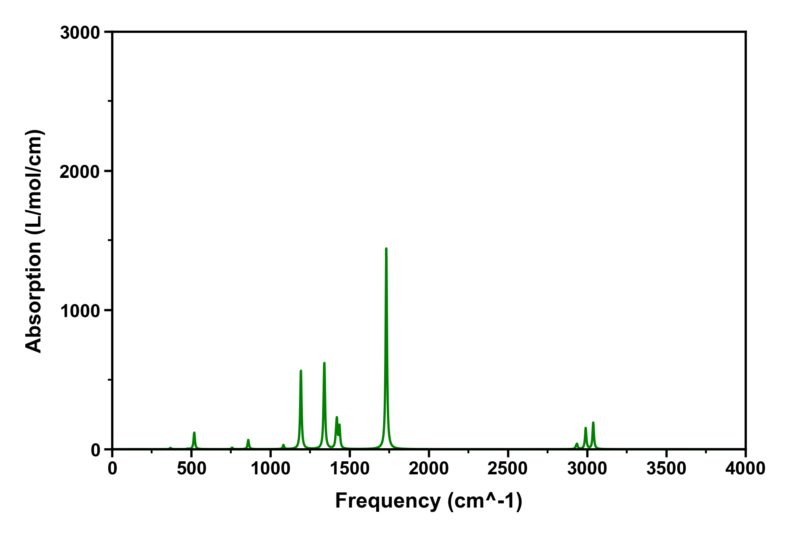
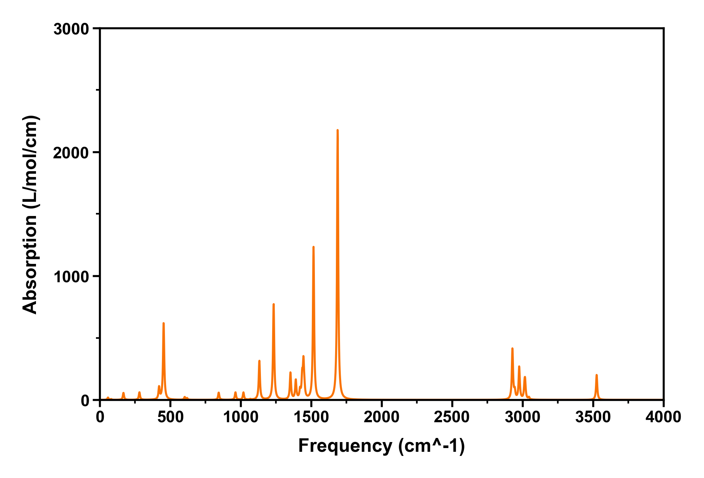

# SpecDraw

SpecDraw 是厦门大学电子科学系 Kimariyb 编写的一个 Go 程序。其主要功能是批量执行 KimariDraw 生成各种光谱图。

## 有关 KimariDraw

KimariDraw 是 Kimariyb 用 Python 编写的绘图脚本，用于处理 Multiwfn 生成的光谱数据。

详细信息请浏览 KimariDraw 的主页： https://github.com/kimariyb/kimariDraw

## 如何使用

设置 Python 的环境变量，这里必须同时设置以下两个环境变量到 PATH 中。其中 `PYTHON_HOME` 是 Python 可执行文件所在的目录。

```shell
%PYTHON_HOME%/
%PYTHON_HOME%/Scripts/
```

安装 KimariDraw 程序，详细信息请浏览 KimariDraw 的主页： https://github.com/kimariyb/kimariDraw

准备一个 `.txt` 文件，假设这个文件名为 `draw.txt`，该文件记录了 KimariDraw 程序中的命令。

```text
-6
6,4
-3
0
Frequency (cm^-1)
1
Absorption (L/mol/cm)
3

r
1
0,4000,500
2
0,3000,1000
0
```

下载 `SpecDraw.exe`，将 `SpecDraw.exe` 和 KimariDraw 需要运行的 toml 文件和 txt 文件（这里的 txt 文件是 KimariDraw 需要的、由 Multiwfn 生成的 txt 文件）放置在同一个文件夹。运行 `SpecDraw.exe` 会在命令行中显示以下内容。程序会提示你输入一个 txt 文件，也可以输入 ENTER 键从 GUI 窗口中选择 txt 文件。

```shell
SpecDraw -- A script that automatically calls KimariDraw to generate pictures in
 batches
Version: v1.1.0, release date: 2023-Sep-02
Developer: Kimariyb, Ryan Hsiun
Address: XiaMen University, School of Electronic Science and Engineering
Website: https://github.com/kimariyb/SpecDraw
(Copyright 2023 Kimariyb. Currently timeline: Sep-02-2023, 14:16:02)

Input txt file path, for example E:\\Hello\\draw.txt
Hint: Press ENTER button directly can select file in a GUI window.
If you want to exit the program, simply type the letter "q" and press Enter.
```

选择 txt 文件后，等待程序运行即可。**中途可能会提示 Error 等报错提示，可以不用理睬，一切以得到的结果为准！**

```shell
Error: exit status 1
```

## 使用效果

下面是使用 SpecDraw 批量执行 KimariDraw 生成的光谱，示例文件在 `example/` 文件夹下可以找到。

<table>
  <tr>
    <td></td>
    <td></td>
  </tr>
  <tr>
    <td></td>
    <td></td>
  </tr>
</table>


## 支持的版本

**SpecDraw 目前仅支持 KimariDraw 2.5.1、2.5.2 的稳定子版本。例如 v2.5.1.3 等。**